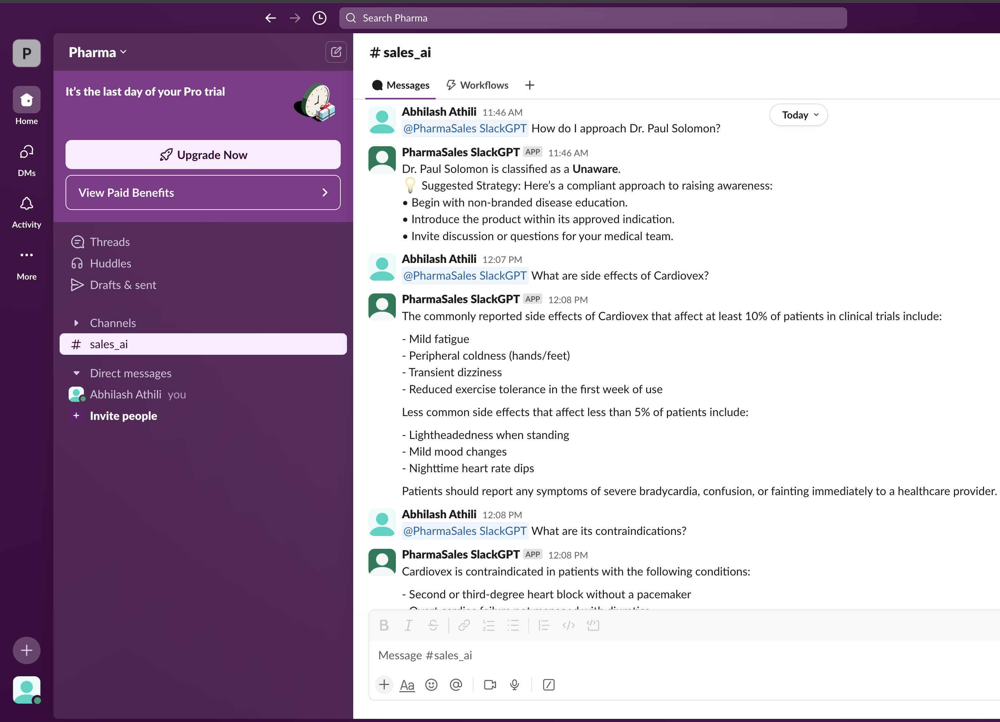
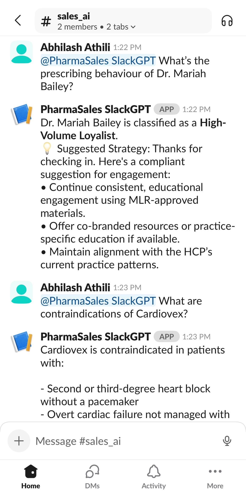

# 💬 PharmaSales SlackGPT

**PharmaSales SlackGPT** is a real-time, compliant, and personalized Slack-integrated AI assistant for pharmaceutical sales reps. It combines machine learning–based HCP segmentation with Retrieval-Augmented Generation (RAG) for compliant drug knowledge responses, enhancing field rep productivity and decision-making.

---

## 🚀 Features

- 💬 **Slack Integration**  
    Built with `slack_bolt`, the app runs in Socket Mode and responds instantly to @mentions. Zero learning curve — reps just type and go!

- 🎯 **HCP Segmentation**
  - Predicts the behavioral segment of healthcare professionals (e.g., *New Adopter*, *Competitor Loyalist*) using a Random Forest model trained on Xponent-style data.

- 🤖 **Compliant Strategy Recommendations**
  - Offers segment-specific, FDA-compliant targeting strategies using pre-reviewed language and tools.

- 💊 **Drug Knowledge Q&A (RAG)**
  - Uses retrieval-augmented generation to provide answers from compliant product knowledge bases.

- 🧠 **Intent Classification with Context**
  - Classifies messages as HCP-related, medical/drug-related, or unknown. Remembers the user’s last drug or HCP for follow-up questions.

---
### 📸 Slack Interaction

> A sales rep asks about Dr. Paul Solomon and follows up with medical queries on Cardiovex.  
> *PharmaSales SlackGPT segments the HCP, retrieves strategy, and responds with compliant medical insights — all inside Slack.*



### 📱 Mobile Experience

> PharmaSales SlackGPT is optimized for field use. Here's an example showing real-time responses to HCP and product queries from a mobile Slack client.



---

## 🛡️ Compliance

- 🔐 All drug responses are retrieved from approved knowledge files.
- 💬 Strategy messages are written using MLR-safe, non-promotional language.
- ❌ No off-label claims, comparative marketing, or subjective superiority.

---

## 🏗️ Project Structure

```
PharmaSales_SlackGPT/
├── app/
│   ├── app.py                  # Main Slack handler
│   ├── model/                  # Trained ML models (Random Forest, Encoder)
│   ├── data/                   # HCP segmentation dataset (Xponent-style)
│   ├── knowledge/              # Drug knowledge text files for RAG
│   ├── handlers/               # Intent routing, RAG logic, segmentation
│   └── helpers/                # Constants, strategy templates, drug list
├── run.py                      # App entrypoint
├── requirements.txt
├── .env                        # Slack + OpenAI keys (not committed)
└── README.md
```

---

## 🧰 Tech Stack

| Component              | Technology              |
|------------------------|--------------------------|
| Chat Interface         | Slack (Socket Mode)      |
| ML Model               | Random Forest (`scikit-learn`) |
| Intent Routing         | Regex + GPT (fallback)   |
| RAG Q&A                | OpenAI + custom retriever |
| Backend                | Python, `joblib`, `dotenv`, `pandas` |
| Deployment-ready?      | ✅ Yes – CLI-based Slackbot |
  
---

## ⚙️ Setup Instructions

```bash
# Create virtual environment
conda create -n pharmabot python=3.11
conda activate pharmabot

# Install dependencies
pip install -r requirements.txt

# Set up environment variables in a .env file:
# SLACK_BOT_TOKEN=xoxb-...
# SLACK_APP_TOKEN=xapp-...
# OPENAI_API_KEY=sk-...

# Run the app
python run.py
```

---

## ♻️ Scalability & Extensibility

- 📂 **Pluggable Knowledge Base**  
  Add new drug files to the `knowledge/` folder — they're automatically indexed for RAG-based retrieval.

- 🤖 **Retrainable ML Model**  
  The HCP segmentation model in the `model/` directory can be retrained with real-world data for improved targeting accuracy.

- 📊 **Updatable Xponent Data**  
  Replace or append the data in `data/` to reflect the latest HCP prescribing behavior.

- 🧩 **Adaptable to Other Domains**  
  The modular design makes it easy to extend this bot for medical device reps, insurance agents, or other consultative B2B sales roles.

- 🌐 **Multilingual Support**  
  The system can be enhanced to support multiple languages using translated knowledge files and multilingual models.

- 🎙️ **Voice Assistant Extension**  
  The assistant can be integrated with voice platforms (e.g., Twilio or Alexa) for hands-free sales enablement.


## 📄 License & Educational Use

This project is developed as a GenAI proof of concept for my Business Intelligence & Analytics program at Stevens Institute of Technology.

This project is for educational and demo purposes only.
Not intended for commercial or production deployment without formal review.